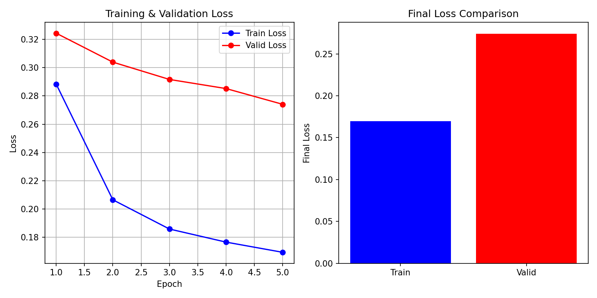
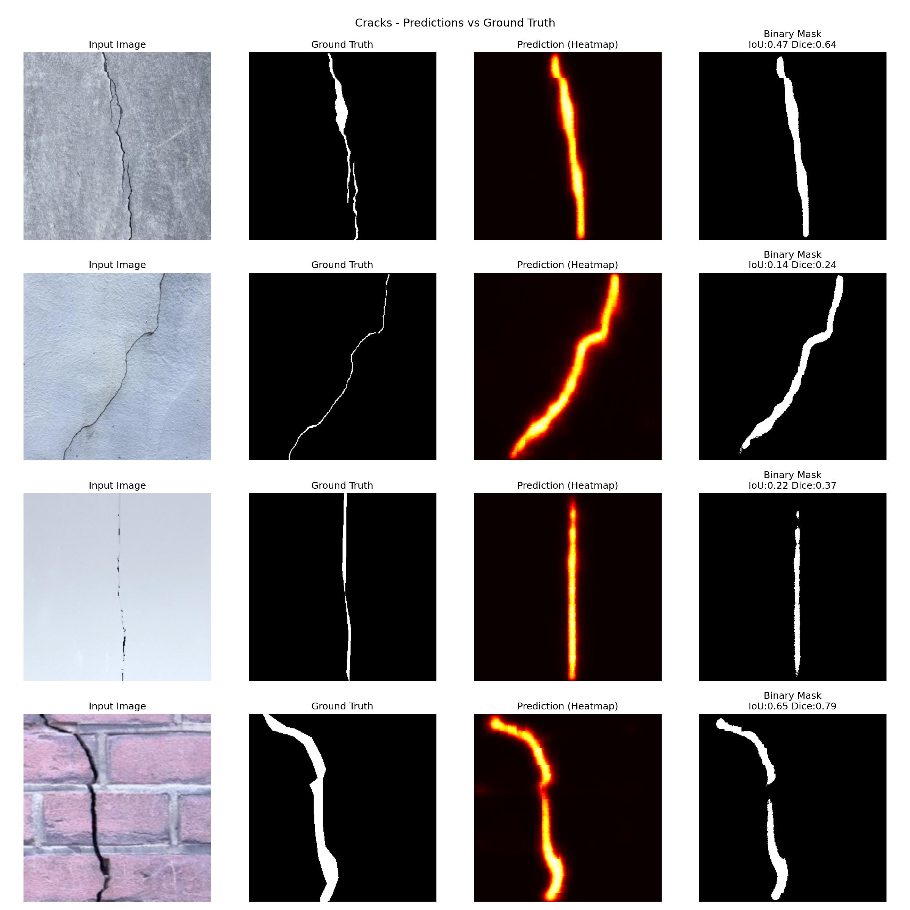
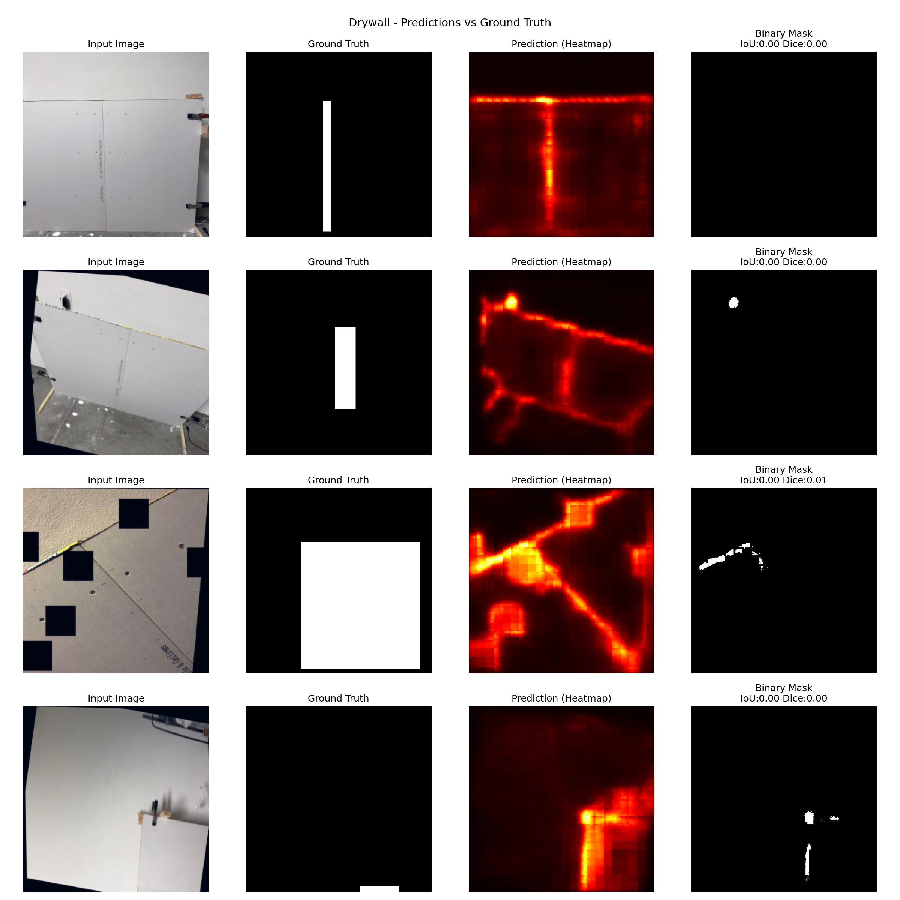
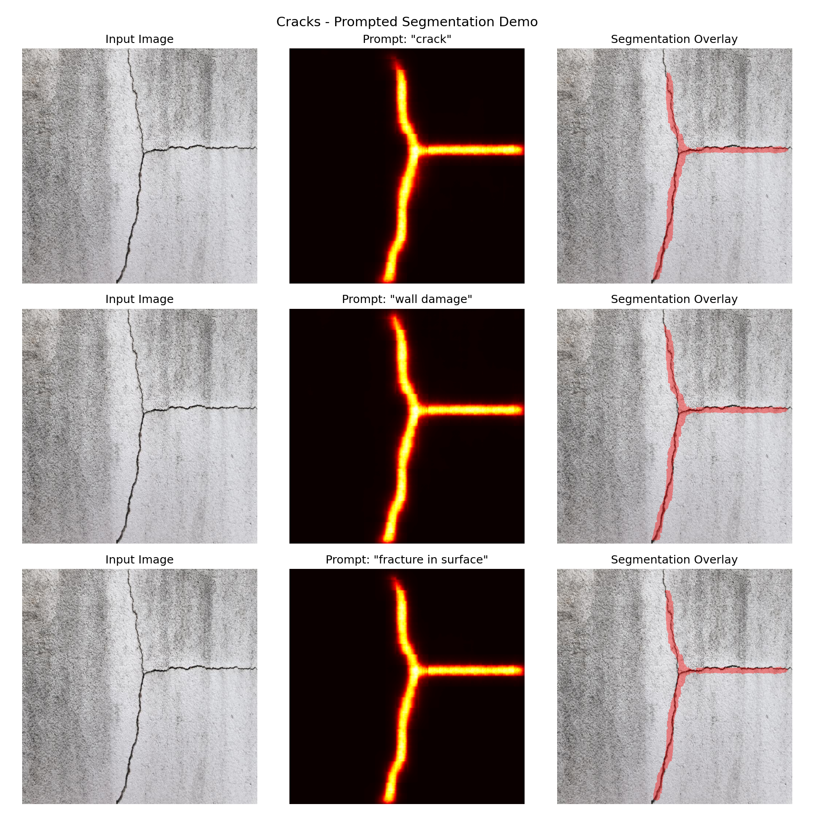
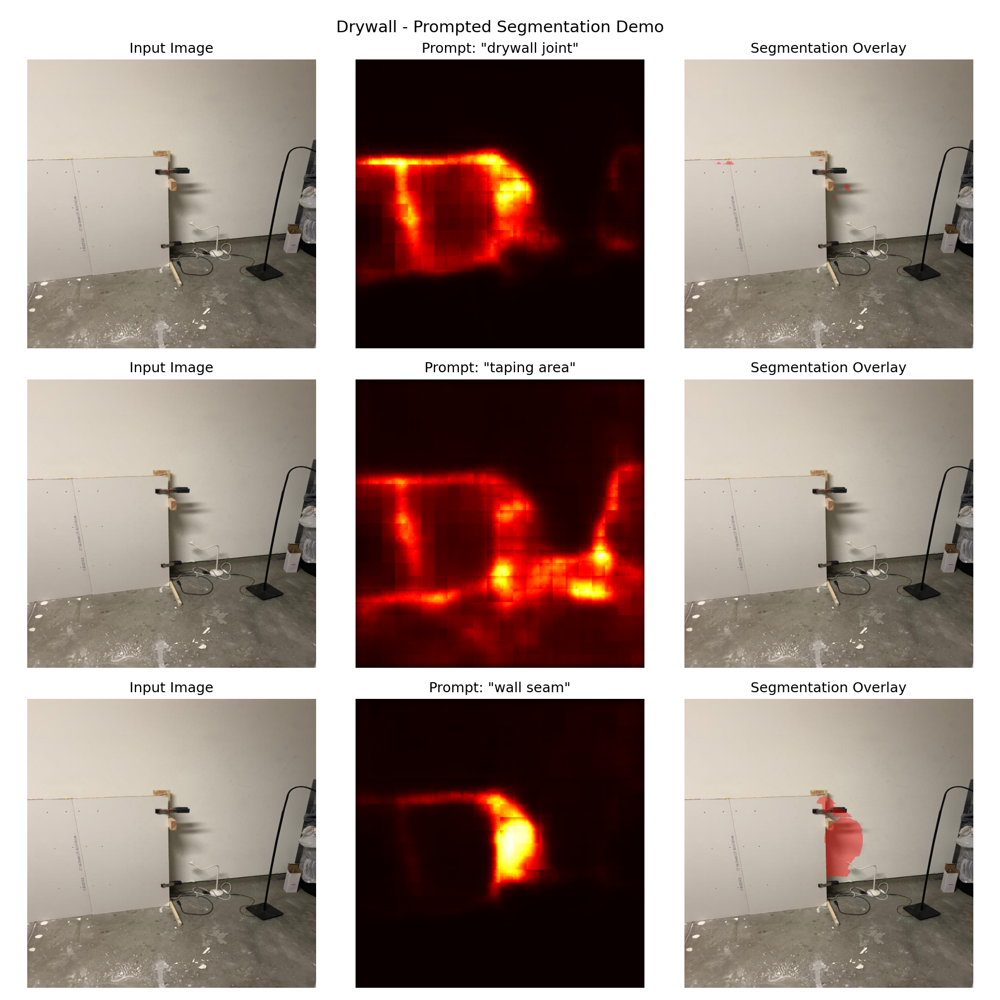

# 🏗️ Prompted Segmentation for Drywall Quality Assurance

<div align="center">


**A text-conditioned segmentation model that processes construction images with natural language prompts to identify defects and features in drywall installations.**

[Features](#-features) • [Results](#-results) • [Installation](#️-installation) • [Usage](#-usage) • [Architecture](#-architecture) • [Training](#-training)

</div>

---

## 📋 Overview

This project implements a **text-prompted segmentation system** for drywall quality assurance using **CLIPSeg**. Unlike traditional segmentation models with fixed classes, this system allows users to specify what they want to segment using natural language:

```
Input: Image of a wall + "segment crack"
Output: Binary mask highlighting all cracks
```

### 🎯 Key Capabilities

| Prompt | Detection |
|--------|-----------|
| `"crack"`, `"wall crack"`, `"fracture"` | Structural damage and cracks |
| `"drywall joint"`, `"taping area"`, `"wall seam"` | Joint compound and taping work |
| `"damaged area"`, `"defect"` | General defects |

---

## ✨ Features

- 🗣️ **Natural Language Prompts** - Describe what you want to segment in plain English
- 🎯 **Dual Dataset Training** - Trained on both drywall joints and crack detection data
- ⚡ **GPU Accelerated** - Optimized for NVIDIA GPUs (tested on Tesla T4)
- 📊 **Comprehensive Metrics** - IoU, Dice Score, and Pixel Accuracy evaluation
- 🔧 **Easy Fine-tuning** - Built on Hugging Face Transformers for easy customization

---

## 📊 Results

### Evaluation Metrics

| Dataset | IoU Score | Dice Score | Samples |
|---------|:---------:|:----------:|:-------:|
| **Cracks** | 0.4277 | 0.5744 | 80 |
| **Drywall** | 0.1234 | 0.1888 | 250 |
| **Overall** | 0.1971 | 0.2823 | 330 |

> **Pixel Accuracy: 90.21%**

### Training Progress

<p align="center">
  
</p>

*Training and validation loss over 5 epochs showing consistent improvement.*

### Prediction Visualizations

#### Crack Detection Results
<p align="center">
  
</p>

#### Drywall Joint Detection Results
<p align="center">
  
</p>

### Text-Prompted Segmentation Demo

The model responds to different text prompts on the same image:

#### Crack Segmentation with Various Prompts
<p align="center">
  
</p>

#### Drywall Joint Segmentation with Various Prompts
<p align="center">
  
</p>

---

## 🏗️ Architecture

```
┌─────────────────────────────────────────────────────────────────┐
│                          CLIPSeg                                │
├─────────────────────────────────────────────────────────────────┤
│                                                                 │
│    ┌──────────────┐                    ┌──────────────┐        │
│    │    IMAGE     │                    │     TEXT     │        │
│    │  (352×352)   │                    │  ("crack")   │        │
│    └──────┬───────┘                    └──────┬───────┘        │
│           │                                   │                 │
│           ▼                                   ▼                 │
│    ┌──────────────┐                    ┌──────────────┐        │
│    │    Vision    │                    │     Text     │        │
│    │  Transformer │                    │  Transformer │        │
│    │    (ViT)     │                    │              │        │
│    └──────┬───────┘                    └──────┬───────┘        │
│           │                                   │                 │
│           │     Image Features          Text Embedding          │
│           │                                   │                 │
│           └─────────────┬─────────────────────┘                 │
│                         │                                       │
│                         ▼                                       │
│               ┌─────────────────┐                              │
│               │   FPN Decoder   │                              │
│               │  (Multi-scale)  │                              │
│               └────────┬────────┘                              │
│                        │                                        │
│                        ▼                                        │
│               ┌─────────────────┐                              │
│               │  BINARY MASK    │                              │
│               │   (352×352)     │                              │
│               └─────────────────┘                              │
│                                                                 │
└─────────────────────────────────────────────────────────────────┘
```

### Why CLIPSeg?

| Feature | Benefit |
|---------|---------|
| **Pre-trained on 400M image-text pairs** | Strong zero-shot understanding |
| **Text-conditioned** | Flexible natural language prompts |
| **Efficient architecture** | 150M parameters, fits on consumer GPUs |
| **Hugging Face integration** | Easy to use and customize |

---

## 🛠️ Installation

### Prerequisites

- Python 3.8+
- CUDA-compatible GPU (recommended)
- 8GB+ RAM

### Setup

1. **Clone the repository**
```bash
git clone https://github.com/Sreenivasan2002/Drywall_QA_Origin.git
cd Drywall_QA_Origin
```

2. **Install dependencies**
```bash
pip install torch torchvision --index-url https://download.pytorch.org/whl/cu118
pip install transformers roboflow opencv-python matplotlib python-dotenv tqdm
```

3. **Configure environment**
```bash
cp .env.example .env
# Edit .env and add your Roboflow API key
```

4. **Download model weights**

Model weights (~600MB) are hosted on Google Drive:
- 📥 [Download best_model.pth](https://drive.google.com/your-link-here)

Place the downloaded file in the project root directory.

---

## 🔍 Usage

### Quick Start

```python
import torch
from PIL import Image
from transformers import CLIPSegProcessor, CLIPSegForImageSegmentation

# Load model
device = "cuda" if torch.cuda.is_available() else "cpu"
processor = CLIPSegProcessor.from_pretrained("CIDAS/clipseg-rd64-refined")
model = CLIPSegForImageSegmentation.from_pretrained("CIDAS/clipseg-rd64-refined")
model.load_state_dict(torch.load('best_model.pth', map_location=device))
model.to(device)
model.eval()

# Load image
image = Image.open("wall_image.jpg")

# Segment with text prompt
prompt = "crack"
inputs = processor(text=prompt, images=image, return_tensors="pt")
inputs = {k: v.to(device) for k, v in inputs.items()}

# Get prediction
with torch.no_grad():
    outputs = model(**inputs)
    mask = torch.sigmoid(outputs.logits[0]).cpu().numpy()

# Threshold to binary mask
binary_mask = (mask > 0.5).astype("uint8") * 255
```

### Batch Processing

```python
prompts = ["crack", "drywall joint", "damaged area"]
images = [image] * len(prompts)

inputs = processor(text=prompts, images=images, return_tensors="pt", padding=True)
inputs = {k: v.to(device) for k, v in inputs.items()}

with torch.no_grad():
    outputs = model(**inputs)
    masks = torch.sigmoid(outputs.logits)
```

### Run in Google Colab

[](https://colab.research.google.com/github/Sreenivasan2002/Drywall_QA_Origin/blob/main/origin_assessment.ipynb)

---

## 🎓 Training

### Dataset Information

| Dataset | Source | Train | Valid | Test | Annotation |
|---------|--------|:-----:|:-----:|:----:|------------|
| **Drywall Joint** | [Roboflow](https://universe.roboflow.com/objectdetect-pu6rn/drywall-join-detect) | 936 | 250 | - | Bounding Box |
| **Cracks** | [Roboflow](https://universe.roboflow.com/fyp-ny1jt/cracks-3ii36) | 2,747 | 80 | 4 | Polygon |
| **Combined** | - | 3,683 | 330 | 4 | - |

### Training Configuration

```yaml
Model: CLIPSeg (CIDAS/clipseg-rd64-refined)
Parameters: 150,747,746
Hardware: NVIDIA Tesla T4 (16GB VRAM)

Hyperparameters:
  epochs: 5
  batch_size: 8
  learning_rate: 1e-5
  optimizer: AdamW
  weight_decay: 0.01
  loss: BCEWithLogitsLoss

Training Time: ~17 minutes
```

### Training Prompts

**Drywall:**
- `"drywall joint"`, `"taping area"`, `"wall seam"`, `"joint compound area"`, `"drywall seam"`

**Cracks:**
- `"crack"`, `"wall crack"`, `"damaged area"`, `"fracture"`, `"crack in surface"`

---

## 📁 Project Structure

```
Drywall_QA_Origin/
├── 📓 origin_assessment.ipynb    # Complete training notebook
├── 📄 final_report.txt           # Detailed evaluation report
├── 📊 evaluation_metrics.json    # Quantitative metrics
│
├── 📈 training_curves.png        # Loss visualization
├── 🖼️ predictions_cracks.png     # Crack detection results
├── 🖼️ predictions_drywall.png    # Drywall detection results
├── 🖼️ demo_cracks.png            # Multi-prompt crack demo
├── 🖼️ demo_drywall.png           # Multi-prompt drywall demo
│
├── 📂 predictions/               # Output masks and overlays
│   ├── cracks/
│   └── drywall/
│
├── 🔒 .env.example               # Environment template
├── 🚫 .gitignore                 # Git ignore rules
└── 📖 README.md                  # This file
```

---

## 🚀 Future Improvements

| Improvement | Expected Impact |
|-------------|-----------------|
| 🎯 Polygon annotations for Drywall | Higher IoU (currently limited by bbox labels) |
| 📊 Data augmentation | Better generalization |
| 🔄 Learning rate scheduling | Improved convergence |
| 🧪 Test-time augmentation | More robust predictions |
| 🌐 Web interface (Gradio/Streamlit) | Easier demonstration |
| 📱 Mobile deployment (ONNX/TFLite) | Edge inference |

---

## 📚 References

- **CLIPSeg:** [Image Segmentation Using Text and Image Prompts](https://arxiv.org/abs/2112.10003)
- **CLIP:** [Learning Transferable Visual Models From Natural Language Supervision](https://arxiv.org/abs/2103.00020)
- **Hugging Face:** [CLIPSeg Documentation](https://huggingface.co/docs/transformers/model_doc/clipseg)

---

## 📄 License

This project is licensed under the MIT License - see the [LICENSE](LICENSE) file for details.

---

## 🙏 Acknowledgments

- [Roboflow](https://roboflow.com/) for dataset hosting
- [Hugging Face](https://huggingface.co/) for the Transformers library
- [CIDAS](https://huggingface.co/CIDAS) for the pre-trained CLIPSeg model

---

<div align="center">

**Made with ❤️ for Construction Quality Assurance**

[⬆ Back to Top](#️-prompted-segmentation-for-drywall-quality-assurance)

</div>
